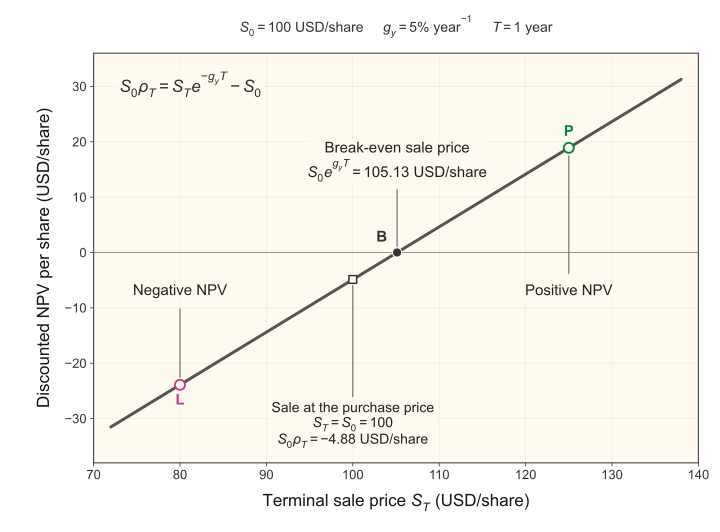

# L4a NPV section: style calibration

Approved by the instructor and applied to the 2026 L4a lecture on September 10,
2026. This section is an approved style reference for future notebook work. It
preserves the current notation and restores the development from the 2025
lecture. The existing trade schematic is retained below with a path relative to
this reference copy; the notebook uses paths relative to its own directory.

Notation follows the 2026 lecture: $n_0$ shares, $T=N\Delta t$, benchmark growth
rate $g_y$, and scaled NPV $\rho_T$. The 2025 lecture supplies the explanatory
progression, not its older notation.

## Theory: Net Present Value (NPV) Trade Rule

Let's use our abstract asset framework to evaluate a stock trade. We will start
with the cash flows from buying and selling shares, then use the net present value
(NPV) to account for the time between these two events.

> __Scenario:__ Suppose we purchase $n_0>0$ shares of ticker `XYZ` at time $0$ for
> $S_0>0$ USD/share. We hold the shares for $N$ time steps and sell all of them at
> time $T=N\Delta t$ for $S_T$ USD/share. Here, $N$ is a positive integer and
> $\Delta t>0$ is the duration of each step in years, so $T$ is the holding period
> in years. We assume no dividends, transaction fees, or bid–ask spread.

This is a __long position__: we buy shares with the expectation that their price
will increase. From our perspective, the purchase is a cash outflow of $n_0S_0$
USD, and the sale is a cash inflow of $n_0S_T$ USD. These are the two cash-flow
events that make up our abstract asset.

The cash flows occur at different times. Following the
[L1b lecture](../week-1/L1b/CHEME-5660-L1b-Lecture-TimeValueMoney-Fall-2026.ipynb),
let $g_y$ denote the constant, continuously compounded annual risk-free growth
rate associated with the selected benchmark yield $y$. The units of $g_y$ are
inverse years, so $e^{-g_yT}$ is a dimensionless discount factor. Multiplying the
sale proceeds by this factor gives their present value. Thus, the NPV of the trade
is given by:

$$
\operatorname{NPV}(g_y,T)
=\underbrace{-n_0S_0}_{\text{purchase today}}
+\underbrace{n_0S_Te^{-g_yT}}_{\text{present value of sale proceeds}}.
$$

The NPV is measured in today's USD and scales with the number of shares we buy.
To express the result relative to our initial investment, let's divide by
$n_0S_0$ and denote the resulting __scaled NPV__ by $\rho_T$:

$$
\begin{aligned}
\rho_T
&=\frac{\operatorname{NPV}(g_y,T)}{n_0S_0}\\
&=\frac{-n_0S_0+n_0S_Te^{-g_yT}}{n_0S_0}\\
&=\left(\frac{S_T}{S_0}\right)e^{-g_yT}-1.
\end{aligned}
$$

> __What does the scaled NPV tell us?__ The quantity $\rho_T$ is a dimensionless
> discounted fractional return on our initial investment. If $\rho_T>0$, the
> present value of the sale proceeds exceeds the purchase cost. If $\rho_T=0$,
> the two are equal; if $\rho_T<0$, the discounted proceeds fall short. Dividing
> by the initial investment removes the dependence on the number of shares,
> allowing us to compare trades of different sizes.

The trade schematic shows how the discounted NPV changes with the sale price.
For a positive benchmark growth rate, the sale price must rise above the purchase
price before the NPV reaches zero.

    

        
    

Let's examine the role of the holding period before connecting this expression
to our lattice model.

### Short holding periods

For a holding period of a few trading days, the discount factor may be close to
one. The condition we need is $|g_y|T\ll1$. Under this approximation, the scaled
NPV becomes:

$$
\rho_T\approx\frac{S_T}{S_0}-1
=\frac{S_T-S_0}{S_0}.
$$

This is the familiar fractional change in the share price. For example, buying
at 100 USD/share and selling at 105 USD/share gives a fractional price return of
0.05, or 5%. When discounting has little effect over the holding period, the
scaled NPV is approximately this same value.

### Longer holding periods

As the holding period grows, discounting can have a substantial effect. We can
see this by asking which sale price makes the NPV zero. Setting $\rho_T=0$ and
solving for $S_T$ gives:

$$
\left(\frac{S_T}{S_0}\right)e^{-g_yT}-1=0
\quad\Longrightarrow\quad S_T=S_0e^{g_yT}.
$$

The break-even sale price is the initial share price grown at the benchmark rate
over the holding period. For $g_y>0$, selling above the purchase price produces a
positive price return, but the sale proceeds must also exceed this benchmark
value for the NPV to be positive. We will retain the exact discounted expression
when computing trade probabilities, so the same calculation applies to both
short and long holding periods.

> __Why is this useful?__ At the time we buy the shares, the future sale price
> $S_T$ is unknown. Our binomial lattice assigns probabilities to its possible
> values. Each possible sale price gives a corresponding scaled NPV through the
> expression we just derived, with the same probability.

We can therefore use the lattice to ask: what is the probability that the scaled
NPV exceeds a specified target at the end of the holding period? Let's develop
that calculation next.
